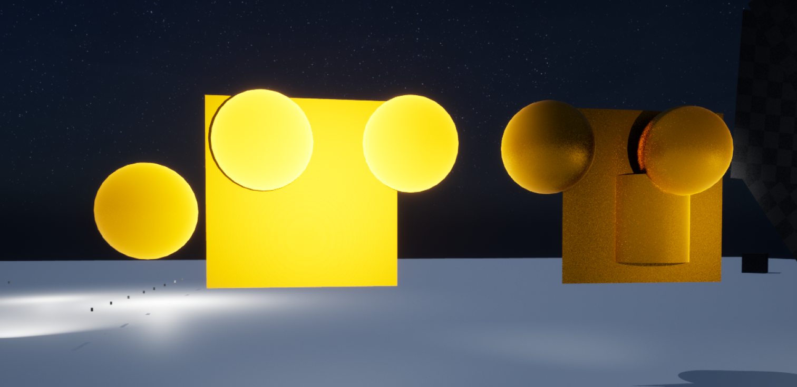

**Unreal Engine 4 & 5 Retroreflection Shader**

**Version 0.4.1**  
Integrated retroreflections into the default lit shading model!  

**Changes:**

- Updated to support Unreal Engine 5.0 Preview 2
- Fixed issue of material turning black if roughness value was above 0.99
- Fixed cooking crash when using the custom retroreflective shading model
- Integrated retroreflections into default lit shading model
- Deprecated retroreflective shading model
- Changed retroreflective specular reflectance model to GTR (Generalized Trowbridge-Reitz) as opposed to GGX (generalized anisotropic GGX)
- Changed retroreflective specular reflectance fresnel model to Schlick-Gaussian (spherical guassian term)
- Added bool and switch to default lit to enable/disable the retroreflection specular terms if the retroreflection mask input == 0
- Added depth fade to the retroreflection specular term (set in ShadingModelsMaterial.ush)

**Supported Engine Versions**
- *4.26.X*
- *5.0.0 Early Access 1 & 2*
- *5.0.0 Preview 2*

**Pick the one thats right for you:**  
You have two options to choose from currently,  
- **Option A**: A single shader file (ShadingModels.ush) that you can drop in to  any binary or source version of Unreal Engine for retroreflections. This comes with the caveat of replacing Clear Coat though.
- **Option B**: Use the custom shading model patch file. This requires a custom source build of Unreal Eninge 4 or 5, but doesn't replace any current shading models.

**Installation:**

**Option A Installation:**  
*Not available for 5.0.0 Preview 2*  
Navigate to the directory in this repository corrosponding to the engine version you wish to add the shader to.  
Once there in the "Drop In" folder you should find a single file called "ShadingModels.ush", download this.  
Open your Unreal Engine 4/5 installation directory and browse to **"Engine/Shaders/Private**  
Find the "ShadingModels.ush" file and **MAKE A BACKUP!!!!**  
Copy in the new file you downloaded and start the engine.  

You must set the material to clear coat and the custom input pins for "Clear Coat" and "Clear Coat Roughness" control the retroreflections.  
The Clear Coat material pin is used for your retroreflection mask, so you can mask parts of your material out that you want to have normal reflections.  
Black = non retroreflective  
White = fully retroreflective  

**Option B Installation:**  
**(RECOMMENDED)**  
Navigate to the directory in this repository corrosponding to the engine version you wish to add the shading model to.  
Once there in the "Custom Shading Model" folder you should find a single file ending in .patch, download this and use git to apply the patch to your copy of Unreal Engine 4/5.  

**For 4.26/5.0EA:**  
You must set the material to "Retro-reflective" and you should now see 2 new custom pins on the material output node called "Retroreflection Mask" & "Retroreflection Depth".  
**For 5.0 Preview 2:**  
You must set the material to "Default Lit" and you should now see 2 new custom pins on the material output node called "Retroreflection Mask" & "Retroreflection Depth".  

The Depth output now controls both a mix of how much light is reflected back and the color intensity. I will be splitting them off soon.  

The "Retroreflection Mask" output is where you plug in your mask, so you can mask parts of your material out that you want to have normal reflections.  

**NOTE:**
The 4.26 and 5.0 EA patch/shading model versions are very early work still, and very messy. They also add 2 extra shading models for alternative diffuse shading methods. You can tweak these yourself, but they will be removed in the next version, if there is a next version as a custom shading model.  
~~I am currently looking into a plugin + drop in shader solution that would allow you to place a single output expression in your material graph to add the functionality.~~  
  
**Credits:**  
William Schilthuis for the original UE4 retroreflective shading model I used as the base for the original version and for inspiring me to write my own.  
https://williamgs.com/posts/unreal-retro-reflective-shading-model/  
